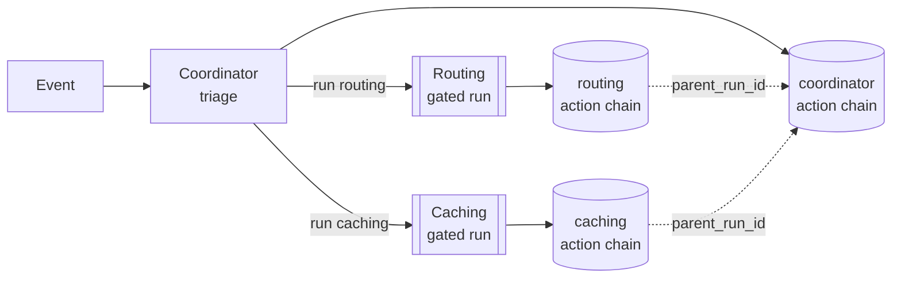
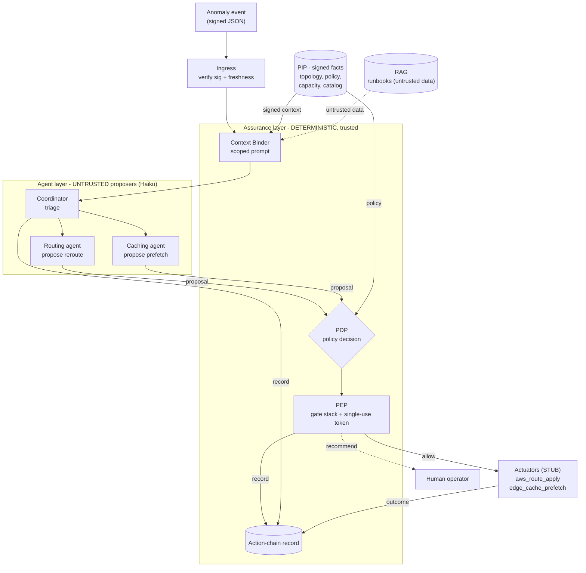
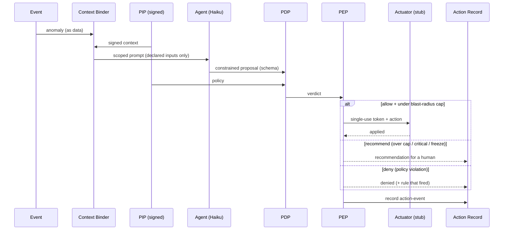
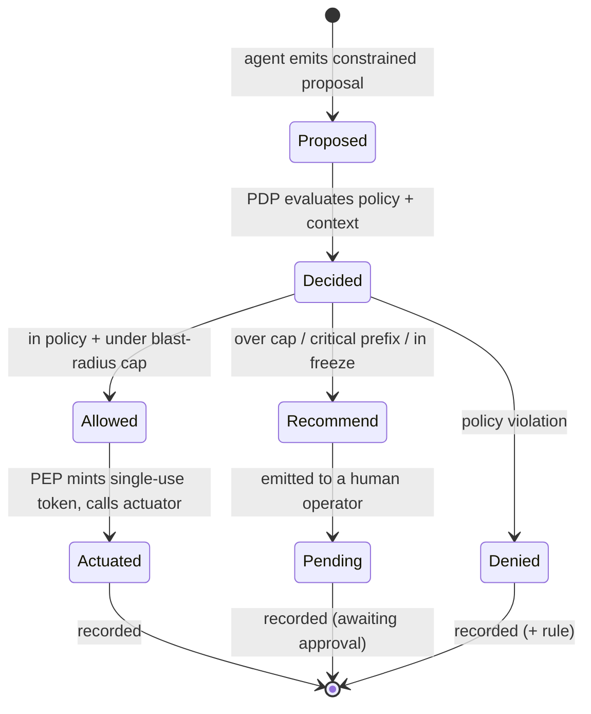

# A Reference Implementation of the Zero Trust Architecture for Event-Driven AI Agents

**Putting an autonomous infrastructure agent behind a deterministic assurance layer, worked end to end**

ScanSet Inc

> **Status.** Companion to `ZT-Reference.md` (the architecture). This document is the concrete
> implementation: a worked enterprise scenario with the assurance layer in place, the components it
> needs, and a testable stub. The cryptographic pieces of the architecture (the signed verifiable log in
> 3.4, the PKI in 3.6.1, single-use tokens in 3.6.2) are referenced and stubbed here; they are the next
> layer, not today's. The Netflix Open Connect scenario is illustrative of a class of problem, not a
> claim about Netflix's internal systems.

---

## Table of contents

1. Purpose and scope
2. The scenario
3. What the assurance layer protects (actionable observability)
4. The agents (the proposer side)
5. The assurance layer (the boundary)
6. Where the reference engine implements it
7. Components (the stub system)
8. The test loop
9. Honest scope and roadmap

---

## 1. Purpose and scope

`ZT-Reference.md` defines the architecture: signed action-events, a Policy Information Point (PIP), a
deterministic Policy Decision Point (PDP), a Policy Enforcement Point (PEP), a model boundary, and a
verifiable action chain. This document shows that architecture applied to one concrete, high-stakes
enterprise job, with the **assurance layer** placed precisely.

The assurance layer is the per-action enforcement-and-evidence engine that implements the model boundary
(3.5) and produces the action chain (3.4.5). It is the part that brackets an agent: it controls what
reaches the agent's reasoning and what the agent's proposals are allowed to do. The reference engine for
it is Ratchet, which already implements context binding, constrained output, a deterministic gate, and a
per-step run record. The full system wraps that core with the signed log and the identity fabric, which
this document stubs.

The point of the layer, stated once: **actionable observability.** Not a dashboard you read after the
fact, but observability wired into enforcement, the same mechanism that records an action can deny it,
route it to a human, mint a scoped credential for it, and prove it later.

## 2. The scenario

A content-delivery network (modeled on Netflix Open Connect) carries a large share of global traffic. An
agent monitors traffic and routing telemetry. It detects an unexpected ISP routing failure in Western
Europe. The desired outcome is predictive infrastructure management and self-healing: compute a
lowest-latency fallback path, change the relevant AWS routing tables, and pre-warm regional edge caches
with upcoming high-demand releases before the evening peak.

Stated naively, that is "an agent autonomously rewrites production routing for a large share of internet
traffic," which is precisely the action no enterprise will permit unguarded, and precisely the action
this architecture exists to make survivable.

**The reframe the assurance layer enforces.** The agent does not act on the environment. It *proposes*.
The assurance layer decides, deterministically, which proposals are safe enough to fire automatically
(in-policy, below a blast-radius cap) and which are handed to a human, fast, with the plan pre-built and
a single-use credential ready. Autonomy exists, but inside a deterministically enforced policy envelope,
and the dangerous tail goes to a person, never to a guess. In this scenario the predictive caching is the
low-blast-radius half (cost and cache warming, reversible) and the routing change is the high-blast-radius
half (a wrong route is an outage). They are gated differently because they are different risks.

## 3. What the assurance layer protects (actionable observability)

Five protections, each enforced rather than merely logged:

- **The blast radius (the environment).** The agent holds no standing credentials and cannot modify
  production routing on its own. A proposed reroute is gated against policy (protected prefixes,
  auto-approvable route classes, a cap on the share of traffic or prefix count affected, change windows).
  Anything over the line is recommend-only with human approval. This prevents an agent-induced outage and
  removes standing power (3.6.2, 3.6.3).
- **The decision (defensibility).** The model plans, and a model is non-deterministic. But every proposed
  change is *authorized* by the deterministic PDP. The authorization is reproducible even though the
  planner is not: "why did EU traffic move to path B at 18:42" has a recorded answer naming the policy
  that fired (2.2.3, 3.3.2).
- **The planning loop (injection and weaponization).** The attack is a spoofed anomaly: fake an ISP
  failure to trick the agent into routing traffic where an attacker wants it. Context binding means the
  telemetry enters the agent's reasoning as scoped **data, never instruction** (3.5.2, 3.5.3), and the
  proposed reroute still has to clear the PDP, which refuses a reroute of a protected prefix regardless of
  what the telemetry claimed. The agent cannot be turned into an attack tool by its inputs.
- **The record (evidence).** The whole chain, anomaly to plan to proposals to verdicts to enforcement to
  outcome, is one action chain. It answers the post-incident and the regulator question with a record,
  not a recollection (3.4.5, 3.7).
- **The credentials (least privilege).** Each approved action is granted a single-use, scoped token: this
  route table, this change, once. A compromised agent cannot accumulate standing infrastructure power
  (3.6.2).

**Honest limits.** The gate enforces policy and form, not the quality of the agent's reasoning. A
policy-allowed action can still be a poor choice within the allowed space; determinism bounds the action
space and the verdict, not the model's selection within it (2.2.3). The protection is only as good as the
policy is explicit; what policy cannot express routes to a human, never back to the model (3.3.2). And
tamper-evidence of the record is the verifiable-log layer (3.4), which this implementation stubs.

## 4. The agents (the proposer side)

This is multi-agent, and the decomposition improves the assurance posture rather than complicating it.

**The decomposition.** One event fans out to specialized agents, each scoped to one domain:

- **Triage / coordinator agent.** Ingests the anomaly, classifies it, decides which downstream agents to
  invoke.
- **Routing agent.** Network domain. Proposes the fallback path and the route-table change. High blast
  radius, route policy, route actuator.
- **Caching agent.** Content domain. Proposes which upcoming releases to pre-warm and where. Lower blast
  radius, budget policy, edge-cache actuator.



**Why split rather than one agent doing everything.** Each split tightens an assurance property:
- *Tighter context binding.* The routing agent sees only routing context, the caching agent only content
  and capacity context. A smaller, cleaner prompt per agent is more reliable; a single agent juggling both
  domains holds more and degrades.
- *Scoped identity (blast-radius separation by identity, 3.6.1, 3.6.3).* The routing agent's identity can
  touch route tools and nothing else; the caching agent's only cache tools. A compromised caching agent
  physically cannot modify a route table.
- *Independent gating.* The routing agent's proposals meet a strict route policy; the caching agent's meet
  a budget policy. Different gates for different risk.
- *Independent records.* Each agent's action chain is separately auditable.

**The invariant: multi-agent does not change the architecture, it multiplies the gated nodes.** Each
agent proposes, each proposal is gated, each is recorded, each holds a scoped identity and single-use
tokens, none is trusted. The coordinator is also an untrusted agent (3.5.5): its decision of which agents
to invoke is gated and recorded like any other. One contract for all agents, the same way it is one
contract for humans and agents (2.2.7).

**What each agent needs.**
- *Required:* a model (the proposer); a constrained proposal schema for its outputs (a route change or a
  prefetch list, never free-form action); and a planning control flow.
- *Optional, on the agent side, untrusted:* a multi-step planning framework (LangGraph or equivalent) may
  run the planning loop. It produces a proposal the assurance layer gates; it earns no authority.
- *Retrieval, split by trust.* Authoritative context comes from the **PIP as signed facts**, the network
  topology of record, the routing policy, capacity and budget limits, the change-freeze calendar, because
  these *drive the gate* and must not be retrieved prose. A **RAG / vector store** may supply untrusted
  enrichment, runbooks, similar past incidents, the content-popularity catalog, as scoped data that shapes
  the proposal but never authorizes it and never becomes instruction (3.5.3). The rule: if a piece of
  context can authorize an action, it is PIP; if it only informs the proposal, it can be RAG.
- *Not on the agent side:* credentials and actuators (behind the PEP), the policy of record (the PIP), and
  the audit log (the assurance layer). Durable state is externalized to the record or the PIP, not held as
  a growing context window.

## 5. The assurance layer (the boundary)



The layer brackets each agent on two sides, and the agent never touches the environment directly:

- **Upstream: trusted prompt construction (context binding).** The agent's prompt is assembled by a
  deterministic constructor from the signed event and scoped PIP context. Untrusted telemetry and
  retrieved content are admitted as labeled data, never as instruction (3.5.2, 3.5.3).
- **Downstream: PDP, PEP, and the record.**
  - *PDP (3.3.2).* A deterministic policy check per proposed action returns allow, deny, or
    allow-but-recommend, plus the rule that fired. For the reroute: route class auto-approvable, no
    protected prefixes, estimated blast radius under cap, inside a change window. For the prefetch: within
    edge capacity and budget, approved content class.
  - *PEP (3.3.3, 3.6.2, 3.6.3).* Applies the verdict through a gate stack, blast-radius threshold (auto
    vs recommend-only), change-freeze, kill switch, fail-safe deny, and mints a single-use scoped token
    per approved action.
  - *Action chain record (3.4.5, 3.7).* Records anomaly, plan, proposals, verdicts, enforcement, and
    outcome as an ordered sequence, one record per agent run, linked to the coordinator's run.

The loop for one agent, end to end:



The same single action as a state machine:



## 6. Where the reference engine implements it

The assurance layer maps onto the reference engine (Ratchet) with no new orchestration model:

- **Context binding** is the engine's per-node input binding (each node sees only declared, scoped
  inputs), which is 3.5.2 and 3.5.3 implemented.
- **Constrained output** is the engine's schema-constrained generate node (3.5.4).
- **The PDP** is the engine's oracle slot, repurposed: instead of a compiler verifying an artifact, a
  policy engine authorizes an action. Same architectural role (a deterministic check the model cannot
  bypass), different function.
- **The action chain** is the engine's per-run record.
- **The multi-agent fan-out** is the engine's sub-flow mechanism: a coordinator flow invokes specialized
  sub-flows, each a gated child run with its own record linked to the parent.

```
coordinator flow  (triage the anomaly, decide which agents)
   |-- routing sub-flow : bind route context -> propose reroute  -> pdp_check(route policy)  -> pep -> record
   `-- caching sub-flow : bind content context -> propose prefetch -> pdp_check(budget policy) -> pep -> record
```

**Provided by the engine:** the flow orchestration, context binding, the oracle slot, and the run record.
**New for this implementation:** the PDP policy and `pdp_check` tool, the `pep_enforce` tool (blast-radius,
freeze, token logic), the actuator stubs, and the PIP content.

Component-to-architecture mapping:

| Component here | ZT-Reference section |
| --- | --- |
| Context Binder (scoped, trusted prompt) | Model boundary, 3.5.2 / 3.5.3 |
| Constrained proposal (schema) | Constrained output, 3.5.4 |
| PDP (deterministic policy decision) | 3.3.2 |
| PEP (gate stack, single-use token, blast-radius split) | 3.3.3, 3.6.2, 3.6.3 |
| PIP (signed facts) | 3.3.1 |
| Ingress verify (sig + freshness) | 3.6.5 |
| Action-chain record | 3.4.5, 3.7 (signed log = 3.4, roadmap) |
| Coordinator + sub-agents | 2.2.7 (one contract); 3.5.5 (orchestrator is an agent) |

## 7. Components (the stub system)

**Agent side (proposer):**
- a model endpoint (local or frontier; canned plans for deterministic tests)
- `coordinate`, `route-plan`, `cache-plan` flows that bind context and emit the proposal schemas
- optional: a small RAG corpus (runbooks, content catalog), or stub for v1

**Assurance layer (the real logic under test):**
- context binder (engine)
- `pdp_check` (deterministic policy evaluation per action)
- `pep_enforce` (gate stack, blast-radius split, single-use token mint)
- actuator stubs: `aws_route_apply` (logs the intended route-table change), `edge_cache_prefetch` (logs
  the intended prefetch); neither touches real infrastructure
- action-chain recorder (engine run record)

**Supporting context (stubbed):**
- event ingress and verifier (read a signed anomaly JSON; signature and freshness stubbed) (3.6.5)
- PIP (signed JSON): topology and candidate fallback paths with latencies, routing policy (protected
  prefixes, auto route classes, blast-radius caps), edge capacity and budget, change-freeze calendar,
  content catalog (upcoming releases and popularity)
- policy file (the PDP rules)
- sample events (the three test paths)

**Real vs stubbed.** Real: the loop, context binding, the PDP and PEP logic, the recorded action chain.
Stubbed: event and PIP signing, the AWS and edge actuators, the single-use token (a generated string
standing in for a real scoped credential), and the tamper-evident log (the unsigned run record stands in
for 3.4).

## 8. The test loop

Three events exercise the allow-auto, allow-recommend, and deny paths:

1. **The base scenario** (EU ISP failure). Coordinator fans out. Caching agent proposes prefetching the
   upcoming releases to EU edge, within budget, **auto-executed** (stub). Routing agent proposes the
   reroute, which touches critical prefixes and exceeds the blast-radius cap, **recommend-only**: the plan,
   the rationale, and a ready single-use token are emitted for a human operator. Two child action chains
   plus the coordinator's, all recorded and linked.
2. **A low-risk reroute** (a non-critical route class, fallback under the cap). PDP allow, **auto-executed**
   via a single-use token.
3. **A spoofed anomaly** attempting to reroute a protected prefix (the hijack attempt). Binding admits it
   as data; the PDP **denies** the protected-prefix reroute; recorded as a denied action with the policy
   that fired.

Run the three events, inspect the three sets of action chains, and the whole loop is demonstrated: the
safe action automated, the dangerous action gated to a human with evidence, and the attack refused.

## 9. Honest scope and roadmap

This implementation is the architecture's **per-action core**, working end to end with the cryptographic
and infrastructure pieces stubbed. To reach the full reference architecture:

- **The verifiable log (3.4).** Today the action chain is a local record; signing each event, hash-linking
  the steps, and proving inclusion and consistency in a witnessed Merkle log is the next layer. The record
  produced here is the substrate that layer signs.
- **Identity and PKI (3.6.1).** The per-agent scoped identities are named here and enforced as policy;
  binding them to real workload identities (SPIFFE/SPIRE) is the production step.
- **Single-use tokens (3.6.2)** and **real actuators.** The token and the AWS/edge calls are stubbed; the
  gate logic that decides and mints is real.

Described outside this workspace, the signed log, the PKI, and the live actuators are "planned" or "next
layer." The model boundary, the deterministic gate, the multi-agent decomposition, and the recorded action
chain are the parts that exist.

---

## Cross-references

- The architecture this implements: `ZT-Reference.md`
- Context binding and the model boundary in the engine: `../concepts/context-binding.md`
- The action-chain record (observability and its schema): `../concepts/observability.md`, `../concepts/run-record.md`
- The deterministic gate (the oracle, repurposed as the PDP): `../concepts/architecture.md`
